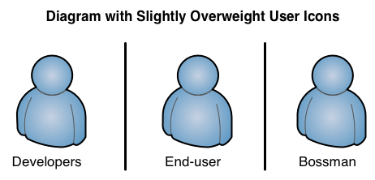
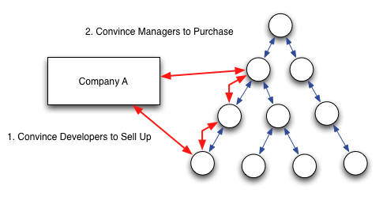
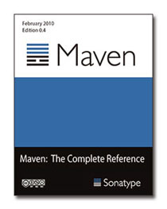
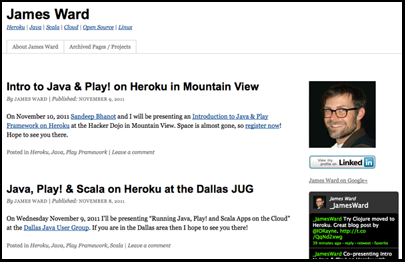
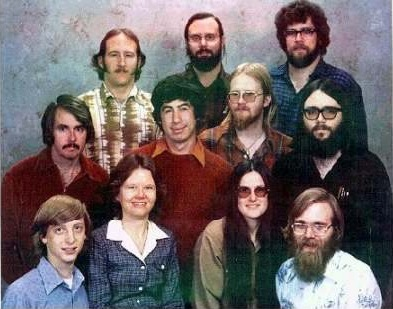

It's all about Whorfianism.
===========================
Tim_O'Brien
:backend:   slidy
:max-width: 45em
:data-uri:
:icons:
:toc!:
:slidetitleindentcar: >>
v1.0, November 2011: ApacheCon 2011

Or, how to introduce Open Source to your Boss (without creating a monster).

We are going to talk about:

* Boundaries

* Language

* Perception

== Boundaries

* Boundaries between:

** Technical and Non-technical

** Developers and End-users

** Core Developers and Casual Developers

This talk focuses on the 1st.

=== Why is this relevant?

Two small reasons:

* If you work for a business, you have to convince managers to:

** Allow you to use Open Source

** Consider participation in Open Source

image::permission.gif[]

=== Why is this relevant?

* Open source businesses 

* Managers make purchasing decisions

* You often have to convince developers to convince management.

* My job is to:

** Jump between these boundaries.

** Help people navigate this boundary.

=== It's all about this

It's all about this equation...

=== More.

What do I mean by Boundary?

* Physics provides the best analogy

image::Partial_transmittance.gif[]

* There is a Transmission Coefficient and a Reflection Coefficient.

* Focusing on the Transmission.  

* Transitioning across a boundary reduces amplitude.

=== Boundaries Reduce Amplitude

* One group understands a technical issue...

* ...and must "tunnel" through a "barrier".

* *First Assertion:* No matter what, some meaning is lost in the transtion.

== Minimizing Boundaries: Developers

* Returning to our three boundaries.

* core developers vs. casual developers.

** Develop a Plugin API

** Create paths for limited involvement

** Focus on Tool Integration

== Minimizing Boundaries: End-users

* Second Boundary

* Developers -> End-users

** Quickstart Documentation

** Cookbooks

** Community (Blogs, Outreach)

Example: Heroku

== Minimizing Boundaries: Business Users

* Nearly Impossible - There's a whole industry built here...

* Most businesses (even technology business) are not run by geeks.

* Yes, there are exceptions (Google, Facebook, Apple)

[role="incremental"]

== Minimizing Boundaries: Business Users

* Management may never truly understand open source in the
  same way that you do.

* That's what this talk is about...

* ...what are the obstacles: language and perception

== Language

Moving on...

=== Warning about Stakeholders

* This presentation:

**  makes assumptions about business stakeholders 

** which may wander outside of 

** commonly acceptable modes of communication.

NOTE: I make fun of your boss.

=== Additional Warning

* Your personal utility 

** may or may not be positively activated 

** by the aforementioned assumptions.

TIP: Make sure your boss doesn't watch this.

=== We joke

We can have a good laugh about this sort of language.

But, it's everywhere.

=== I'm not kidding

* No, but really, 

* ...there's a language problem across this particular bounary.

* *Common experience:*  Does that person even understand the words they are using?

=== An example from eWeek

A real quote from eWeek (this week):

"Cloud banking should be innovative, dedicated to this industry and
transformative."

Among the most attractive benefits of cloud banking is being able to
deploy (in an economically feasible way) the “champion-challenger”
model. This adds a competitive dynamic to the way processes are
improved and chosen. As banks progressively replace people in the
value chain with algorithmic operations (AOs) to run processes and
make decisions, their intellectual property increasingly resides in
these algorithms. The value of people is not in running operations but
in improving the AOs, the report said.

“Cloud banking has the ability to drive ‘creative destruction,’”

WARNING: Huh?

=== What that just said...

"Banks are saving money by firing people and..."

"...replacing them with clouds."

NOTE: ...but why didn't they just say that?

=== The Secret of Business

Businesses have perfected the art of delivering bad news.

They play with language, ever read 1984 by George Orwell?

This isn't new.

[role="incremental"]
George Orwell wrote about this in 1946 "Politics and the English Language"

=== Orwell saw this happening...

"Modern English, especially written English, is:"

* "full of bad habits"

* "which spread by imitation, and"

* "which can be avoided if one is willing to take the necessary trouble."

"If one gets rid of these habits one can think more clearly"

=== More Orwell, More!

Orwell's biggest complaints:

* "staleness of imagery" 

* "lack of precision"

=== More more Orwell, More!

He continues:

* "[A] mixture of vagueness and sheer incompetence"

* "the most marked characteristic of modern English prose"

[role="incremental"]
* "As soon as certain topics are raised,... prose consists less and less of words chosen for the sake of their meaning, and more and more of phrases tacked together like the sections of a prefabricated henhouse."

[role="incremental"]

=== Language: Conclusion

If you are going to convey a message to business users, some tips:

* Learn how to read "prefabricated henhouses"  (Read eWeek)

* Understand this vague and incompetent language

* Simplify your message

TIP: Optimize for the boundary...

* One last tip...

=== Resist the Henhouse

When you can, resist the henhouse.

* Avoid Euphemism

* Someone says "ROI" or "Win-win" tell them you don't understand.

* Ask people to define empty phrases.

TIP: But, don't be a jerk about it.  I don't want you to get fired.

=== Example: Margin Call

At 59:20, the President to a Junior risk analyst:

"Please, speak as you might to a young child or a golden retriever..."

"...it wasn't brains that got me here, I can assure you of that."

== Perception

== We're Still Answering FUD

- "I now wonder if open source may have been a fad, or perhaps just a more elaborate iteration of the shareware phenomenon in the 1980s." - John Dvorak, PCMag, 2007
- Microsoft's ill-fated Institute for Software Choice in 2002

A certain brand of Executive still considers open-source "Unamerican"

== FOX News

From 2005: "Activists Urge Free Open Source Software"

PORTO ALEGRE, Brazil —  Activists at a leftist gathering where Microsoft is viewed as a corporate bogeyman urged developing nations Saturday to leap into the information age with free open source software (search).

John Barlow, a lyricist for the Grateful Dead, told a gathering inside a packed warehouse that poor nations can't solve their problems unless they stop paying expensive software licensing fees.

Read more: http://www.foxnews.com/story/0,2933,145827,00.html#ixzz1Oolmvu2y

== Big Disconnect

- Gartner Reports OSS at >50% Penetration

From Gartner OSS Survey Feb/2011: "less than 10 percent five years ago to more than an expected 30 percent within the next 18 months."

- But... Most Businesses still haven't a clue about Open Source

== All I Needed to Hear was "Free"

The Most Important Disconnect

- You might mean "Freedom"
- Your boss hears "Worthless"

== Case Study: We Never Expected This

=== Bad

Boss: "What is Hadoop?"

You: "Hadoop is great, I've been using for a few years and have watched the community grow over time.    Everything from the ASF is safe to use from a licensing standpoint, but I'm not lawyer.  The volunteer community is great, and I think we should contribute any changes back to Apache.   There's this CLA and CCLA form that needs to be signed, should I just get everyone to sign it?"

=== Worse

Our application uses a bunch of open source libraries.   We don't distribute anything, so don't worry about licensing or anything.  It doesn't matter.

== Breaking an Assumption

- Stop trying to educate
- Define yourself as the professional

== Stop Asking for Permission

Get this into your Head:

- You are a Technical Professional
- Take Ownership of Technical Decisions

If you flew here, did you question the pilot about he approach pattern?

== Understand the Enemy

- Programmers focus on Technology
- Managers focus on Intangibles (and Control)

== Know Your Profession: Licensing

You must understand the following issues multiple perspectives:

- Why would a business choose GPL vs. ASL
- Is there legal precedent?
- 

== Use Professional Terminology

You might shy away from using these terms, but you need to convey a sense of professionalism.

- Provenance
- Governance
- Ecosystem

=== Good

Our infrastructure relies on Apache Hadoop, a project with solid governance with multiple companies providing commercial support.   Our own engineers participate in the ongoing management of the project to ensure that 
 
=== Conclusions

- Never use the word "Free"
- Emphasize Open Source Communities as Professional Organizations
- Don't present Open Source as an "Alternative"

 
 
